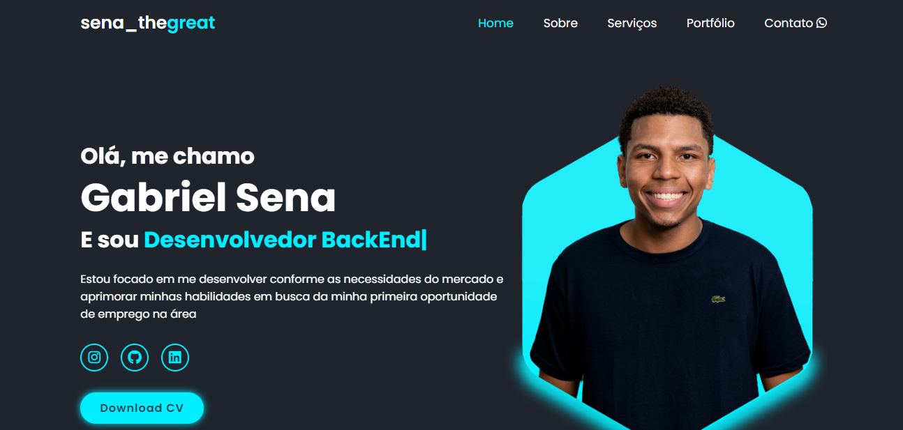

<h1 align="center"> PortFolio Gabriel Sena </h1>

  <a href="#-tecnologias">Tecnologias</a>&nbsp;&nbsp;&nbsp;|&nbsp;&nbsp;&nbsp;
  <a href="#-projeto">Projeto</a>&nbsp;&nbsp;&nbsp;|&nbsp;&nbsp;&nbsp;
  <a href="#-layout">Layout</a>&nbsp;&nbsp;&nbsp;|&nbsp;&nbsp;&nbsp;
  <a href="#memo-licença">Licença</a>

  

 

  

## 🚀 Tecnologias

Esse projeto foi desenvolvido com as seguintes tecnologias:

- HTML e CSS
- JavaScript, Scrool Reveal, TypedJs
- Git e Github
- Figma

## 💻 Projeto

O meu repositório tem o foco em divulgar minhas competências.

- [Acesse o projeto finalizado, online](https://thegabrielsena.github.io/repositorioGabrielSena/)

## 🔖 Layout

Você pode visualizar o layout do projeto através [DESSE LINK](https://www.figma.com/file/PIZHFylQ2DPIQyZa7c9S2f/Reposit%C3%B3rio-Gabriel-Sena?type=design&t=2dqFuJNgYxXYghYp-1). É necessário ter conta no [Figma](https://figma.com) para acessá-lo.

## :memo: Licença

Esse projeto está sob a licença MIT.

---

Feito com ♥ por sena_thegreat
